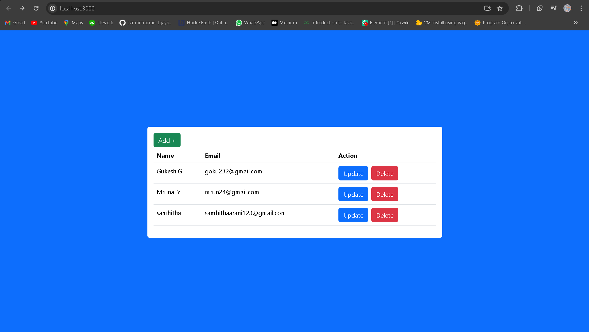

# User Management Application

This is a simple user management application built with React for the frontend and Express.js with MySQL for the backend. The application allows users to create, update, delete, and view user information.

## Features

- **View Users**: Displays a list of all users.
- **Create User**: Allows the creation of new users with details such as name, email, phone number, and date of birth.
- **Update User**: Enables updating the details of an existing user.
- **Delete User**: Removes a user from the database.

## Technologies Used

- **Frontend**: React, React Router, Bootstrap
- **Backend**: Express.js, MySQL
- **HTTP Client**: Axios

## Prerequisites

- Node.js
- MySQL

## Installation

1. **Clone the repository**
   ```bash
   git clone https://github.com/samhithaarani/crud.git
   cd crud
   ```
2. **Setup Frontend**
```bash
cd crud/frontend
npm install
npm start

   ```
3. **Setup Backend**
```bash
cd crud/backend
npm install
node server.js 


   ```
``` sql
CREATE DATABASE task;
USE task;
CREATE TABLE users (
    id INT AUTO_INCREMENT PRIMARY KEY,
    fullname VARCHAR(255) NOT NULL,
    emailid VARCHAR(255) NOT NULL,
    phoneno VARCHAR(15) NOT NULL,
    dob DATE NOT NULL
);


   ```
## Usage 
- Access the application by navigating to http://localhost:3000 in your web browser after starting both the frontend and backend servers.
- Use the provided interface to manage users as described in the features section.

